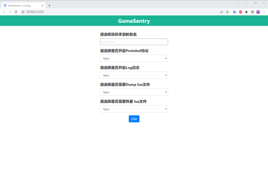
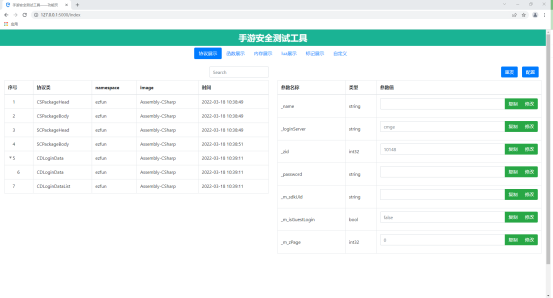
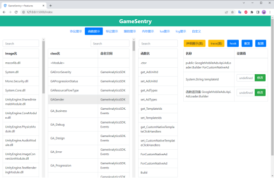
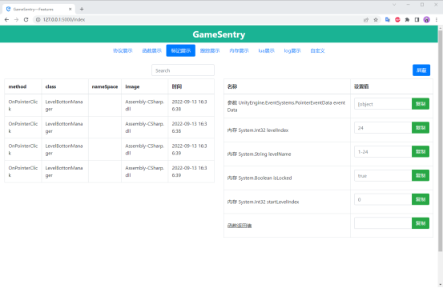
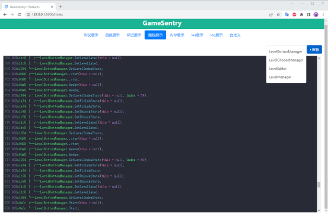
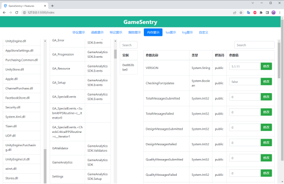
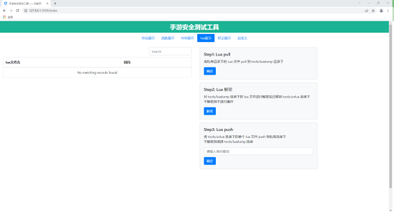
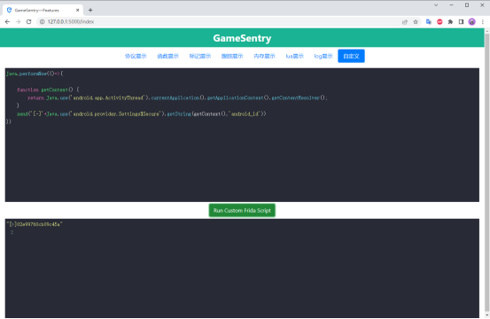

# 功能说明文档

## 配置界面------功能展示

### 界面说明

| 名称               | 描述           |
| ----------------------------------- | ------------------------------------------------------------ |
| 请选择目标手游的包名                | 点击选择需要测试的手游，直接输入应用名会进行匹配             |
| 请选择是否开启Protobuf协议          | 获取使用的protobuf相关协议数据（协议类需要满足一定规则）     |
| 请选择是否需要Dump lua文件          | 本地dump lua相关代码，进行lua修改                            |
| 请选择是否需要热更 lua文件          | 本地dump lua代码之后，进行实时修改，无需重启注意：此配置与Dump lua配置不能同时开启 |
| 请选择是否开启Log日志，暂无显示界面 | 获取Unity游戏本地日志，实时输出                              |

备注：
protobuf协议满足规则：1.定义在c#（lua脚本中的协议暂不支持）2.使用官方原生的生成方式，不支持魔改后的protobuf识别。

## 功能界面——协议展示

对应配置界面功能——请选择是否开启Protobuf协议

### 界面说明

| 名称               | 描述           |
| -------- | ------------------------------------------------------------ |
| 左边列表 | 实时展示当前的协议内容，当有多个相同的协议时候，会自动进行折叠展示 |
| 右边列表 | 左边列表单行数据的详细展示，包含各种字段                     |

### 功能说明

| 名称               | 描述           |
| -------- | ------------------------------------------------------------ |
| 搜索框   | 本地搜索匹配当前列表的内容                                   |
| 复制按钮 | 弹框弹出当前指定参数名的参数值                               |
| 修改按钮 | 对当前指定参数名进行参数值修改，修改按钮只针对单行           |
| 配置按钮 | 使修改按钮修改的参数值进行提交，再次请求的时候协议字段就会变更 |
| 重发按钮 | 对当前协议的内容进行重发，修改后的内容会即时生效             |

## 功能界面——函数展示

### 界面说明

| 名称               | 描述           |
| --------- | -------------------------------- |
| 左边列表1 | 展示所有image                    |
| 左边列表2 | 对指定image，展示所有的class     |
| 右边列表1 | 对指定的class，展示所有的函数名  |
| 右边列表2 | 展示对应的函数名的参数以及返回值 |

### 功能说明

| 名称               | 描述           |
| ------------ | ------------------------------------------------------------ |
| 搜索框       | 本地搜索匹配当前列表的内容                                   |
| 修改按钮     | 对当前函数的参数以及返回值进行修改，修改按钮只针对单行       |
| 配置按钮     | 使修改按钮修改的参数值进行提交，函数的参数以及返回值会对应的修改 |
| 重发按钮     | 对当前函数进行重发，修改后的内容会即时生效                   |
| 详细展示按钮 | 展示当前选中的class的详细信息                                |
| trace按钮    | 对选中的class进行跟踪，如果调用则输出到跟踪展示              |
| hook按钮     | 对当前的函数进行hook，实时展示函数执行的所有内存信息         |

## 功能界面——标记展示

### 界面说明

| 名称               | 描述           |
| -------- | -------------------------------------------------------- |
| 左边列表 | 实时展示hook的函数执行的信息                             |
| 右边列表 | 展示对应函数内的参数以及返回值，并且展示指定类的内存信息 |

### 功能说明

| 名称               | 描述           |
| -------- | ------------------------------ |
| 搜索框   | 本地搜索匹配当前列表的内容     |
| 屏蔽     | 关闭选中函数的hook             |
| 复制按钮 | 弹框弹出当前指定参数名的参数值 |

## 功能界面——跟踪展示

### 界面说明
| 名称               | 描述           |
| ---------- | ----------------------- |
| 唯一展示框 | 实时展示trace的执行结果 |

### 功能说明

| 名称               | 描述           |
| ---- | -------------------- |
| 屏蔽 | 关闭目标class的trace |

## 功能界面——内存展示

### 界面说明

| 名称               | 描述           |
| --------- | ------------------------------------------ |
| 左边列表1 | 展示所有image                              |
| 左边列表2 | 对指定image，展示所有的class               |
| 左边列表3 | 对指定的class，展示内存中此class的所有实例 |
| 右边列表1 | 展示指定class的所有字段内存信息            |

### 功能说明

| 名称               | 描述           |
| -------- | ----------------------------------- |
| 修改按钮 | 对当前class的内存进行修改，实时生效 |
| 搜索框   | 本地搜索匹配当前列表的内容          |

## 功能界面——lua展示

对应配置界面功能——请选择是否需要Dump lua文件|请选择是否需要热更 lua文件

### 界面说明

| 名称               | 描述           |
| -------- | ------------------------- |
| 右边列表 | 对lua文件的具体操作步骤   |
| 左边列表 | 实时展示加载存在的lua文件 |

### 功能说明

| 名称               | 描述           |
| -------------- | ------------------------------------------------------------ |
| step2 确定按钮 | 如果是luac文件，则执行此步骤对luac进行还原lua在指定文件夹下  |
| step3 输入框   | 将对应的lua文件的绝对路径复制到输入框内                      |
| step3 确定按钮 | 将lua文件又放置到手机私有目录下并进行文件替换dump lua配置下，可能需要重启生效热更 lua配置下，会即时生效，无需重启 |
| step1 确定按钮 | 将手机的私有目录的lua文件夹传输到本工具对应的文件夹下        |

## 功能界面——自定义

### 界面说明

| 名称               | 描述           |
| ---------- | ------------------------------------------------ |
| 下边输入框 | 实时展示自定义脚本的执行结果                     |
| 上边输入框 | 输入自定义执行的脚本，支持javaScript与typeScript |

### 功能说明

| 名称               | 描述           |
| --------------------------- | -------------------- |
| Run Custom Frida Script按钮 | 执行对应的自定义脚本 |

 
