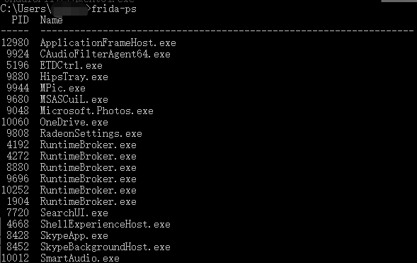
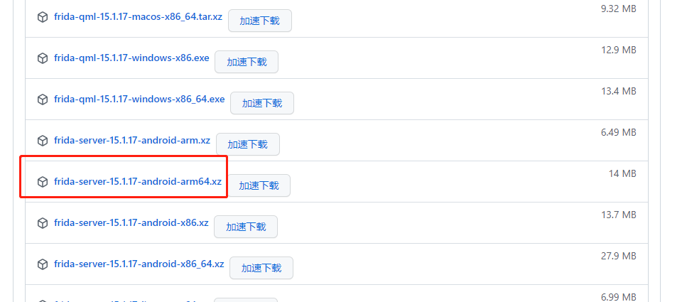
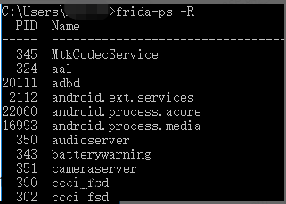
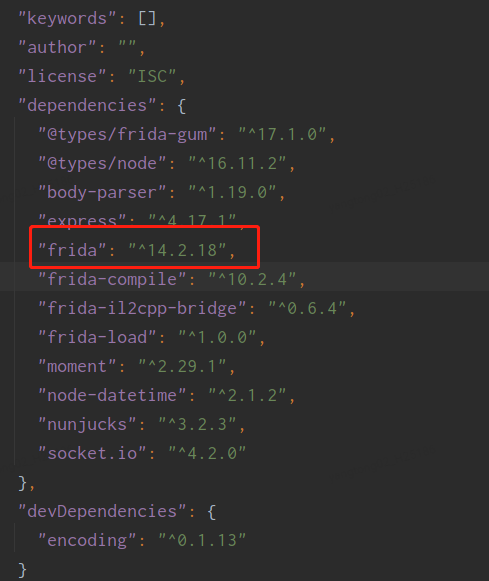
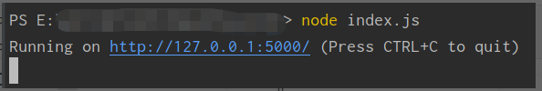

# 使用说明文档


**不支持模拟器，手机需要root,建议使用未做保护的apk**


兼容列表

| unity il2cpp | ✔    |
| ------------ | ---- |
| unity mono   | ❌    |
| cocos-js      | ✔     |
| cocos-lua     | ✔    |

**一、环境安装：**

**1.1 Frida 安装**

**1.1.1 安装frida库**

pip install frida pip install frida-tools

运行 frida-ps，效果如下则为成功



**1.1.2 安装frida-server**

**需要与电脑安装的frida版本一致，**手机架构也需要注意。

https://github.com/frida/frida/releases



下载成功后，执行如下命令：

```
# 把解压后的文件 push 到手机上
adb push 你电脑里面frida-server-15.1.17-android-arm64的路径 data/local/tmp
adb shell
su
cd data/local/tmp
# 修改改文件的执行权限
chmod 777 frida-server-15.1.17-android-arm64
./frida-server-15.1.17-android-arm64 
# (另开一个窗口)最后就是做端口转发就行了。
adb forward tcp:27042 tcp:27042
adb forward tcp:27043 tcp:27043
# 查看 Android 进程列表
    frida-ps -R
```



**1.2 安全工具安装**

从git上拉取工具代码

找到package.json文件，打开文件，将配置文件中frida版本替换为本台设备安装的frida版本。



输入命令(在根目录下)：


```shell
npm install  
node index.js
```

如图则为运行成功，打开http://127.0.0.1:5000/ 即可。



**注意：****工具运行时，需要保证frida-server一直处于运行状态****！**
